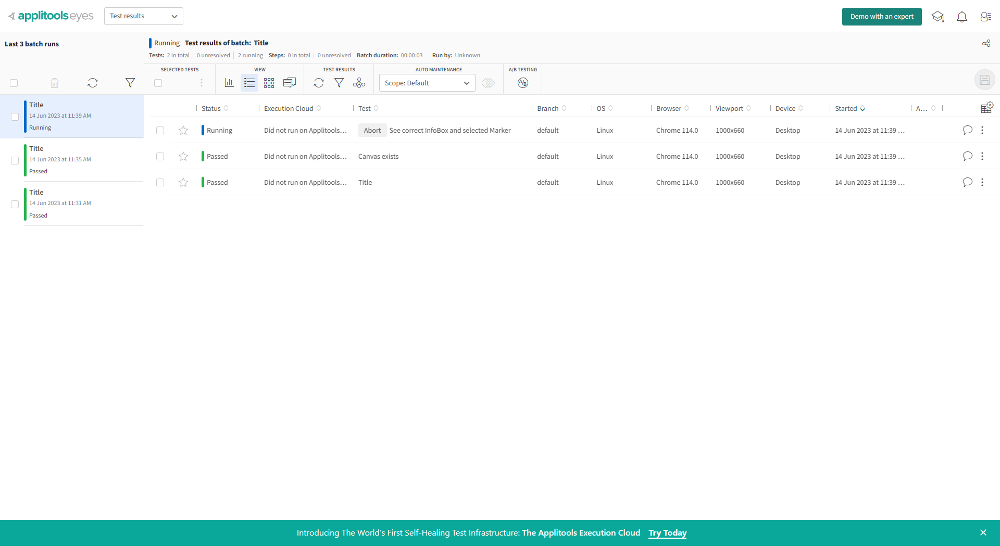
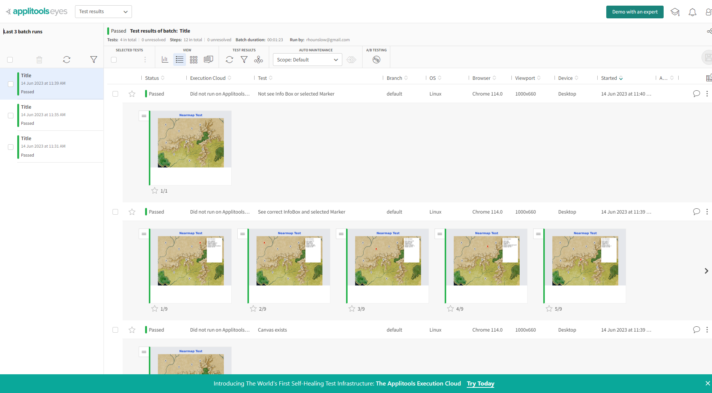
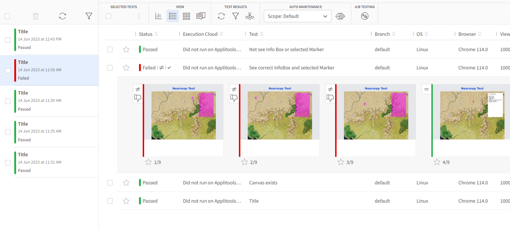
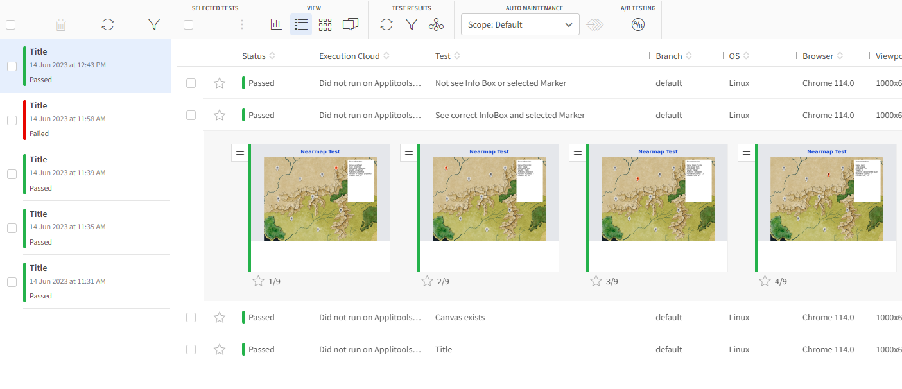

# HTML 5 Canvas Map - React, Konva, Cypress, Applitools & Firebase

Finished Result: https://nearmap-test.firebaseapp.com/
Note: Desktop only

## Tech

Dev and Build Server

- Scaffold w/ CRA
- Why?
  - React Testing Lib (RTL), Jest and Webpack built-in
    - Know it well and its reliable
  - Currently exploring Vite which much faster

Front End Framework

- React
- Why?
  - Fast
  - Flexible simple paradigm
  - Most popular FE frame work - for good reason
  - Loads of community support

Language

- Typescript
- Why?
  - Type safety (prevent typing errors)
  - Makes working with APIs easier

Testing

- Jest and React Testing Library (RTL)
  - Why?
    - Built into CRA (compatible w/ Vite/Vitest)
    - Tried and tested - pardon the pun
- Cypress
  - Why?
    - Good for e2e and functional testing
  - Found it to be less flakey than Selenium

Canvas Library

- React Konva
- Why?
  - Declarative
    - Similar paradigm to React
  - Good community support and docs

Styling

- CSS Tailwind
- Why?

  - Utility first
    - Classes that serve a single purpose
      - one class, one style.
    - Dont get lots multiple CSS files, conventions, classes and styles doing the same thing
    - No overriding of opinionated styles to override

- Note: Konva, which is being used for the drawing and interaction with the canvas, doesn't directly support CSS styles

# Testing

## Thinking and Philosophy

- Using Typescript mitigates the need for most unit tests, it now catches many of the traditional errors that JavaScript solutions produce. eg. passing the wrong values to functions.

- In React unit tests can often restrict devs being flexible, it potentially stymies creativity, playing with ideas, speed of change and modifying units of work. This does not apply to library code, where unit tests are great, esp. if they encapsulate complex algorithms/math and/or lots of integration where changing one thing could break other things.

- Therefore integration tests are better In my opinion. Similarly end-to-end testing in React which replicates user behavior is a great way to make sure your changes are not breaking other things in you code base. Again, where changing one thing could break other things.

- Having said that this app is rendered on a HTML Canvas, we are going to have to use a tools like Cypress or Selenium to do some sort of of "visual regression testing" with snapshots with potentially visual or exact pixel comparisons.

- NOTE: This is not locked in stone. Just my thinking for the moment.

## Tests with Jest & React Testing Library (RTL)

Used more as smoke test in this app to ensure veerything hs rendered properly w/ the right attributes

```
npm test
```


## Tests with Cypress

Used for functional and e2e testing.

via the Cypress Interface

```
 npm run cy:open
```

https://1drv.ms/v/s!AoWo5-07ozmCgaqGXJQC6sDfCZXWv_k?e=Xb3b7D

<video controls>
  <source src="<video controls>
  <source src="https://1drv.ms/v/s!AoWo5-07ozmCgaqGXJQC6sDfCZXWv_k?e=Xb3b7D" type="video/mp4">
  Your browser does not support the video tag.
</video>

via the Commandline

```
npm run cy:run:app_spec_all
```


## Tests with Cypress and Applitools

These tests automate 'visual regression testing' and compare the baseline screenshots (taken on the 1st run) with subsequent test runs.

Note: without a license I cannot give access to anyone else. Sorry. 

```
npm run cy:run:app_spec_all_applitools
```





# Fixing flaky unreliable visual testing - with [Cypress](https://www.cypress.io/) & [Applitools](https://applitools.com)

- As mentioned to me during our first meeting, your most significant problem was the flakiness of Selenium, so here a proposed solution - that works.

- In the commit, "fix async hack", I made a change as a result of a failed run through Cypress/Applitools, this happened when I had quickly coded a double-click on a Marker rather than properly using the async statement .then,  ...I was in a hurry.

- So I updated the code, and it fixed (likely) the problem.<br/>
(I would run more tests, but I have reached my quota) 

- See the code update here; [**fix async hack**](https://github.com/rikster/html5-react-konva-cypress-firebase/commit/6a165579c3f884f6a2159c32336d455a2c3f311e), and the failed and subsequent passed tests below:<br/>

## Failed 'Visual regression test'  



## Passed 'Visual regression test' - after fix



Ps. solid - no flakiness :)
