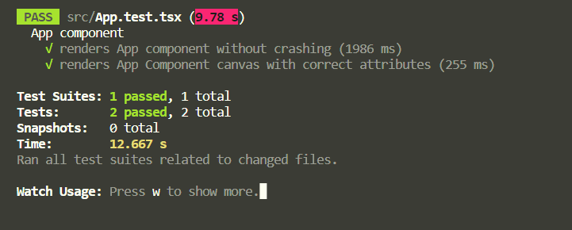

# Nearmap JS Test

Welcome to the [Nearmap](nearmap.com) JS test. The purpose of this assignment is to test your familiarity with web development, JS, React, and TDD.

## Task

Build a simple app using React.

Take a look at [wireframe-mockup.jpg](./assets/wireframe-mockup.jpg) to get a feel for what we're after.


The application should:

- Display [background-map.jpg](./public/background-map.jpg).
- Load the map data from [map-data.json](./src/data/map-data.json).
- Populate the map with markers. See [marker.png](./public/marker.png) and [marker-selected.png](./public/marker-selected.png).
- When the user clicks on a marker, an information box will appear, showing the information for that location.
- When the user clicks on the map, the marker will deselect, and the information box will disappear.

Assume the app and data set will grow over time. The initial architecture should take this into account.

## Testing your app

We would like to be able run the following in the root of the project and have the app run locally:

Install and Start

```
npm install
npm start
```

Testing (see thoughts below)

If you have any further instructions, please include in the project's `README.md`.

In terms of browser support, we only require the latest Chrome version.

## Submission instructions

- **DO NOT** fork this repository or create pull requests on it as we don't want other candidates to see your solution.
- Provide your solution as a `.zip` or .`gz` archive file, either via email or some Dropbox-like service, to your Nearmap contact.

# Submission Response

## Tech

Dev and Build Server

- Scaffold w/ CRA
- Why?
  - React Testing Lib (RTL), Jest and Webpack built-in
    - Know it well and its reliable
  - Currently exploring Vite which much faster

Front End Framework

- React
- Why?
  - Fast
  - Flexible simple paradigm
  - Most popular FE frame work - for good reason
  - Loads of community support

Language

- Typescript
- Why?
  - Type safety (prevent typing errors)
  - Makes working with APIs easier

Testing

- Jest and React Testing Library (RTL)
  - Why?
    - Built into CRA (compatible w/ Vite/Vitest)
    - Tried and tested - pardon the pun
- Cypress
  - Why?
    - Good for e2e and functional testing
  - Found it to be less flakey than Selenium

Canvas Library

- React Konva
- Why?
  - Declarative
    - Similar paradigm to React
  - Good community support and docs

Styling

- CSS Tailwind
- Why?

  - Utility first
    - Classes that serve a single purpose
      - one class, one style.
    - Dont get lots multiple CSS files, conventions, classes and styles doing the same thing
    - No overriding of opinionated styles to override

- Note: Konva, which is being used for the drawing and interaction with the canvas, doesn't directly support CSS styles

# Testing

## Thinking and Philosophy

- Using Typescript mitigates the need for most unit tests, it now catches many of the traditional errors that JavaScript solutions produce. eg. passing the wrong values to functions.

- In React unit tests can often restrict devs being flexible, it potentially stymies creativity, playing with ideas, speed of change and modifying units of work. This does not apply to library code, where unit tests are great, esp. if they encapsulate complex algorithms/math and/or lots of integration where changing one thing could break other things.

- Therefore integration tests are better In my opinion. Similarly end-to-end testing in React which replicates user behavior is a great way to make sure your changes are not breaking other things in you code base. Again, where changing one thing could break other things.

- Having said that this app is rendered on a HTML Canvas, we are going to have to use a tools like Cypress or Selenium to do some sort of of "visual regression testing" with snapshots with potentially visual or exact pixel comparisons.

- NOTE: This is not locked in stone. Just my thinking for the moment.

## Tests with Jest & React Testing Library (RTL)

Used more as smoke test in this app to ensure veerything hs rendered properly w/ the right attributes

```
npm test
```



## Tests with Cypress

Used for functional and e2e testing.

via the Cypress Interface

```
 npm run cy:open
```

via the Commandline

```
npm run cy:run:app_spec_all
```


